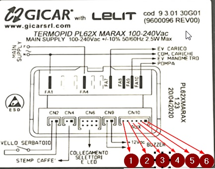
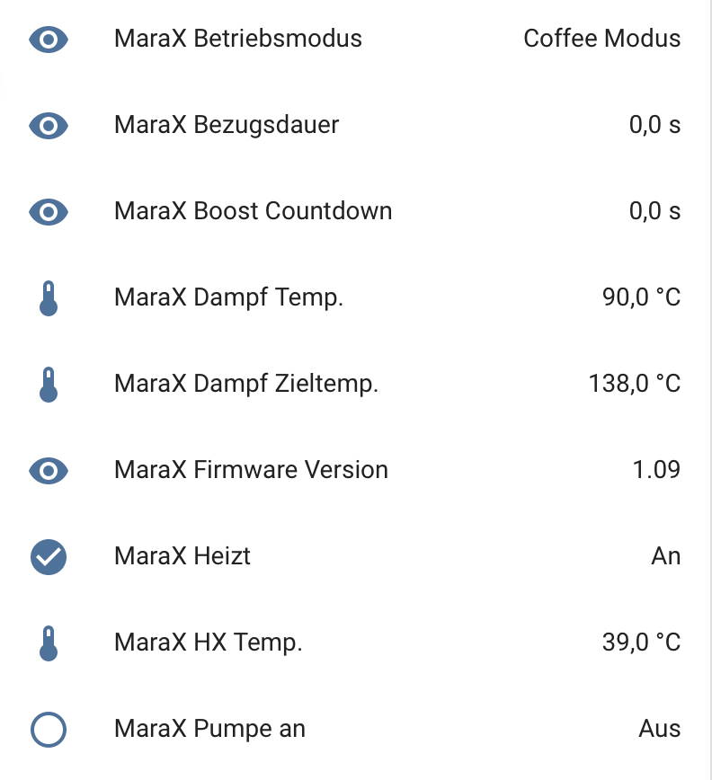
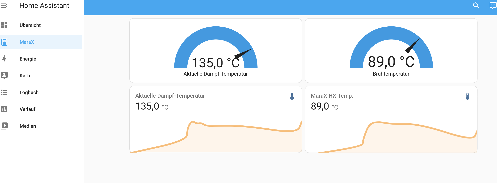

# Home Assistant Integration for Lelit MaraX with ESPHome - Headless version

This is a fork from: https://github.com/manyos-robert/esphome-marax 

Robert Manyos build an integration for my Lelit MaraX Espresso Machine for Home Assistant using https://esphome.io.

This integration is based on this great https://www.reddit.com/r/espresso/comments/hft5zv/data_visualisation_lelit_marax_mod[Reddit article]

== Some Links (TODO)

* https://github.com/alexrus/marax_timer 
* https://github.com/bancbanus/marax_monitor
* https://github.com/SaibotFlow/marax-monitor 
* https://github.com/RedNomis/MaraXObserver/blob/master/MaraXObserver.ino
* https://www.kaffee-netz.de/threads/vorstellung-projekt-espresso-shot-timer-mit-temperaturanzeige.85390/page-27#post-2072253
* https://www.kaffee-netz.de/threads/lelit-mara-x-shot-timer.148272/page-3
* https://www.kaffee-netz.de/threads/lelit-marax-pl62x.125870/page-14
* https://esphome.io/components/sensor/custom.html
* https://esphome.io/components/sensor/wifi_signal.html
* https://esphome.io/custom/uart.html
* https://esphome.io/cookbook/lambda_magic.html
* https://github.com/esphome/esphome
* https://github.com/esphome/feature-requests/issues/1447
* https://docs.espressif.com/projects/esp-idf/en/latest/esp32/api-reference/system/log.html
* https://community.home-assistant.io/t/how-to-uart-read-without-custom-component/491950
* https://esphome.io/components/sensor/template.html
* https://community.home-assistant.io/t/* how-to-pass-a-variable-from-home-assistant-front-end-to-esphome/183845
* https://community.home-assistant.io/t/how-to-pass-a-variable-from-home-assistant-front-end-to-esphome/183845
* https://community.home-assistant.io/t/how-to-update-a-globals-variable/338882
* https://www.reddit.com/r/Esphome/comments/mszx2m/publishing_a_global_variable_to_home_assistant/
* https://github.com/esphome/esphome-docs/blob/current/components/sensor/uptime.rst
* https://esphome.io/components/sensor/template.html
* https://github.com/esphome/esphome
* https://www.esp32.com/viewtopic.php?t=2499
* https://esphome.io/guides/automations.html#global-variables
* https://esphome.io/components/esphome.html#esphome-libraries
* https://esphome.io/components/esphome.html#esphome-includes
* https://esphome.io/components/esphome.html
* https://community.home-assistant.io/t/how-to-uart-read-without-custom-component/491950
* https://community.home-assistant.io/t/time-to-c-invalid-conversion-from-uint8-t/485089
* https://community.home-assistant.io/t/how-to-include-standard-c-header-files-in-esphome-yaml-file/354128
* https://github.com/esphome/issues/issues/3135
* https://esphome.io/api/esp32_2core_8cpp_source.html
* https://www.best-microcontroller-projects.com/arduino-millis.html
* https://forum.arduino.cc/t/using-millis-in-my-own-library/462562
* https://reference.arduino.cc/reference/en/language/functions/time/millis/
* https://community.home-assistant.io/t/measure-switchon-time/152484/3
* https://community.home-assistant.io/t/time-sensor-like-a-stop-watch/180663
* https://esphome.io/components/sensor/index.html
* https://esphome.io/components/time/index.html
* https://community.home-assistant.io/t/measure-switchon-time/152484
* https://esphome.io/components/sensor/custom.html#logging-in-custom-components
* https://favtutor.com/blogs/split-string-cpp
* https://www.tutorialspoint.com/c_standard_library/c_function_sscanf.htm
* https://www.youtube.com/watch?v=W8e0sJmxeO8
* https://www.kaffee-netz.de/threads/vorstellung-projekt-espresso-shot-timer-mit-temperaturanzeige.85390/page-27#post-2072253
* https://github.com/RedNomis/MaraXObserver/blob/master/MaraXObserver.ino
* https://www.kaffee-netz.de/threads/lelit-mara-x-shot-timer.148272/
* https://community.home-assistant.io/t/home-assistant-integration-for-lelit-marax-with-esphome/530847
* https://github.com/benovic/marax_display/blob/main/marax_display/marax_display.ino
* https://www.reddit.com/r/espresso/comments/hft5zv/data_visualisation_lelit_marax_mod/
* https://github.com/surealdb/esphome-marax/blob/main/coffee.yaml
* https://esphome.io/components/binary_sensor/index.html#binary-sensor-is-on-binary-sensor-is-off-condition
* https://esphome.io/components/sensor/index.html#config-sensor
* https://unsinnsbasis.de/esp32-pico-kit/
* https://unsinnsbasis.de/esp32-pin-belegung/
* https://unsinnsbasis.de/esp32-erste-schritte/#Pin-Belegung_des_ESP32
* https://community.home-assistant.io/t/home-assistant-integration-for-lelit-marax-with-esphome/530847
* https://randomnerdtutorials.com/esp32-pinout-reference-gpios/
* https://www.simon42.com/esphome-esp32-esp8266-grundlagen/#ressourcen
* https://community.home-assistant.io/t/home-assistant-integration-for-lelit-marax-with-esphome/530847
* https://coffeetime.freeflarum.com/d/417-lelit-mara-x-v1-and-v2-the-differences/38

== My adjustments

I'm very thankful for that work, but for my use case I wanted to add some adjustments:

* Headless mode: no external display, no 3D printing, no cables outside going into the MaraX
* Testing environment: beeing new to esphome.io I needed a simple C++ Testing environment and added a Xcode Project for it (beeing a mac user), here is space for improvements as it needs some modifications to convert the code in to the yaml lambda entry (see "TODO" marker)
* As I have MaraX V2 Controller, the data format changed. I changed the code to be more tolerant for the different data formats, basically to all formats I found in the web (see test scenarios in C++ file)
* MaraX V2 Controller also deliveres the *pump state*, so I added a time counter to *count the brewing time*
* Enable/Disable debug logging using a single bool: debugMode 

== Hardware used

Disclaimer: my approach involves a (not too invasive) modifictation of the MaraX which may lead you to loose the waranty. If you follow my described steps you do this on your own risk! Anyhow eletric installations should only be done by registered electritians (at least in Germany)

=== ESP32

* In my variation I used:
** AZDelivery ESP32 Dev Kit C V4 NodeMCU WLAN WiFi Development Board with CP2102 to connect with the serial UART2 interface of the MaraX.
** https://www.amazon.de/dp/B07Z83MF5W
* Actually a ESP8266 would be OK as well, its just that I wanted a best possible Wifi experience as the signal must go through th 

=== Power supply

* I use a 230V to 5V power supply: 
** MEAN WELL APV-8-5 LED-Schaltnetzteil 5V 1400mA 7W IP42
** https://www.amazon.de/dp/B06Y2B8QNH
* It is small enough to fit into the MaraX case including the case for the ESP32

=== Case 

* Having no 3D printer I used a an existing case:
** sourcing map 61 x 36 x 25 mm Anschlussdose Kunststoff Elektronik Gehäuse DIY Abzweigdose Projekt Box Gehäuse Klein, Grau Weiß
** https://www.amazon.de/dp/B07JG66DPY
* The box fits exactly the ESP32 I used, but to connect the jumper cables I had to bend the 5 pins I used to a 45 degree angle
* After opening 2 of the cable holes in the lid of the case with a knife I lead 3 jumper cable through 2 hole, and the 2 jumper cables to the power supply through the other
* One may tighen the wholes with silicon or glue

=== Jumper wire cables

* I used these female to female cables:
** AZDelivery Jumper Wire Kabel 40 STK. je 20 cm F2F Female to Female
** https://www.amazon.de/dp/B07KYHBVR7 
* NOTE: https://github.com/SaibotFlow/marax-monitor[SaibotFlow states]: For testing you can use the jumper-wires later you should replace them with temperature protected cables.

== Connections

=== Power Supply

The Gicar box (Controller, No 9600096) of MaraX is connected to the main supply (F for phase, N for neutral). 
This is where we can get the 230V for the above mentioned power supply (brown for phase, blue for neutral).
In the diagram its FA1 and FA4.

I used a blade terminal like this: https://www.kabelschuhe-shop.de/Cembre-RF-FM608-Doppelflachsteckerhuelse-63-x-08-rot-025-15mm-teilisoliert[Cembre RF-FM608 Doppelflachsteckerhülse 6,3 x 0,8 rot 0,25-1,5mm² teilisoliert] ("Piggy Back Spade Quick Splice Crimp Terminals")
It should be isolated using a shrinking tube (Schrumpfschlauch) or similar. 

The plug is connected instead of the orignal F and N plugs and the original ones are connected to side connector of the crimped terminal.

At the ESP the RED (plus) cable is in 5V pin, and the BLACK (minus) cable in one of the two GND (Ground) pins.

=== MaraX UART Serial Interface Pinout

I found some irritating information about the serial interface (CN10) on the web. It may be, that this is differnent for the different Gicar Box Hardware versions, but this would be somehow surprising.

As I only have a V2 here, I used the Infos provided by user "birdhouse" in https://www.kaffee-netz.de/threads/lelit-mara-x-shot-timer.148272/page-2#post-2197905[Kaffee Netz] and it worked without any issues. His machine is produced in August 2022 and has firmware version C1.10. 

Also SaibotFlow https://github.com/SaibotFlow/marax-monitor#the-interface[confirms this] with his V2 marax-monitor.

My own Version is 1.09, so I believe its correct this way:

At MaraX Gicar (see diagramm above):

* 3 - TX
* 4 - RX
* 5 - GND

At ESP32 this is connected to:

* 3 (TX) to rx_pin: GPIO17
* 4 (RX) to tx_pin: GPIO16
* 5 (GND) to GND (the ESP32 has 2 GND pins, just choose one)
** GND might be optional, but I read advices that it improves the reliablity.

== Data formats

The coffee machine sends one of the following data about 2-4 times a second:

=== MaraX V1 Controller:

* 1.23b (https://www.kaffee-netz.de/threads/lelit-mara-x-shot-timer.148272/page-2#post-2192587[source])

C123b,095,112,063,1095,1

* First Character: C or S for Coffee-/Steam-Priority. 
* Followed by the current firmware version.
* Second value: Actual steam temperature
* Third value: Target steam temperature
* Fourth value: Actual Heatexchanger temperature
* Fifth value: Remaining timer for fast heating
* Sixth value: Heating on/off

=== MaraX V2 Controller:

* This format including the pump information is send by:
** 1.06 (https://github.com/SaibotFlow/marax-monitor[source])
** 1.09 (mine)
** 1.10 (https://github.com/RedNomis/MaraXObserver/blob/master/MaraXObserver.ino[source])

C1.06,116,124,093,0840,1,0\n

* C	Machine-Mode: C = CoffeeMode; V = Vapour/SteamMode (in my machine its "+" instead of "V" - I do support both)
* 1.06	Firmware
* 116	Current Steam Temperature in Celsius
* 124	Target Steam Temperature in Celsius
* 093	Curent Hx Temperature in Celsius
* 0840	Countdown Boost-Mode
* 1	Heat state (0 = off; 1= on)
* 0	Pump state (0 = off; 1= on)

== Result

In Home Assistant the data can be used to build dashboards.

